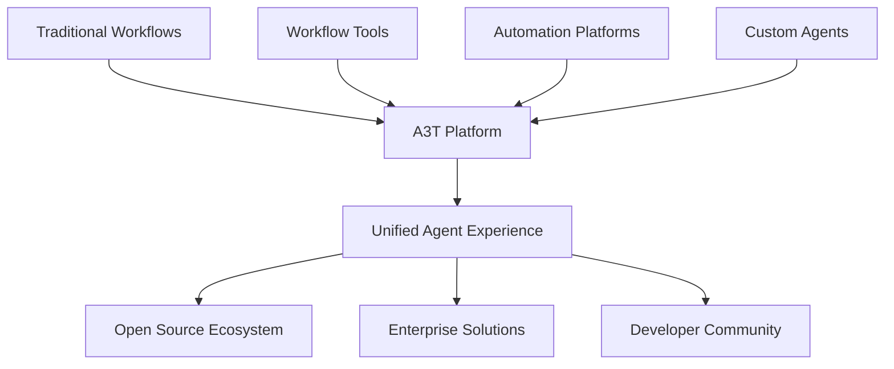

  <h1>🚀 A3T AI</h1>
  
<strong>Democratizing Agentic Workflows for Everyone</strong>

  
  

    <a href="https://a3t.ai">🌐 Website</a> •
    <a href="https://a3t.ai/docs">📚 Documentation</a> •
    <a href="https://a3t.ai/community">💬 Community</a>
  

  

    
    
    
  

---

## 🎯 Our Mission

At **A3T (AGENT)**, we're building the future of agentic workflows. Our vision is simple yet ambitious: make intelligent automation accessible to everyone, from individual developers to enterprise teams.

We believe in an **open source world** where powerful AI agents aren't locked behind complex barriers. That's why we're creating a **highly opinionated, yet flexible platform** that seamlessly integrates with the tools you already love.

## 🛠️ What We're Building

### 🔧 **Unified Workflow Platform**
- **Seamless Integration**: Works with popular workflow tools and automation platforms
- **Opinionated Architecture**: Carefully crafted defaults that just work
- **Enterprise Ready**: Built for scale from day one

### 🎨 **Developer Experience First**
- **Easy Onboarding**: Get started with agents in minutes, not hours
- **Intuitive Interface**: Complex workflows made simple
- **Extensible Design**: Customize everything to fit your needs

### 🌍 **Open Source DNA**
- **Community Driven**: Built with and for the community
- **Transparent Development**: Open roadmap and development process
- **Collaborative Growth**: Your contributions shape the future

## 🚀 Why A3T?

| Traditional Approach | A3T Approach |
|---------------------|--------------|
| ❌ Complex setup and configuration | ✅ One-click deployment |
| ❌ Fragmented tool ecosystem | ✅ Unified platform experience |
| ❌ Steep learning curve | ✅ Intuitive, opinionated design |
| ❌ Enterprise-only features | ✅ Powerful features for everyone |

## 🔮 The Future We're Building

## 🌟 Get Involved

We're just getting started, but we're building something special. Here's how you can be part of the journey:

- 🌐 **Visit our website**: [a3t.ai](https://a3t.ai)
- 📖 **Read our docs**: Learn about our vision and roadmap
- 💬 **Join our community**: Connect with fellow builders and early adopters
- 🐛 **Report issues**: Help us build a better platform
- 🤝 **Contribute**: Code, docs, ideas - every contribution matters

## 📫 Connect With Us

  

    
    
  

---

  
<strong>Building the future of agentic workflows, one commit at a time.</strong>

  
<em>🚀 A3T - Where Agents Meet Simplicity</em>

